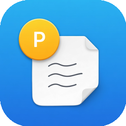

<p align="center">
  
</p>

<h1 align="center">proomet</h1>

<p align="center">
  A native macOS prompt manager for your AI workflow.
</p>

<p align="center">
  
  
  
  
  
</p>

<p align="center">
  <a href="README_zh.md">中文文档</a>
</p>

---

## About

**proomet** is a lightweight, native macOS application for organizing and managing AI prompts. It provides a clean three-pane interface to create, categorize, tag, and quickly copy prompts for use with any LLM.

## Features

- **Three-pane layout** — Sidebar navigation, prompt list, and Markdown editor
- **Category & tag organization** — Group prompts by categories and filter with tags
- **Markdown editor** — Syntax-highlighted editing with variable placeholder support (`{{variable}}`)
- **One-click copy** — Copy prompts to clipboard instantly with toast feedback
- **Usage tracking** — Track how often and when each prompt was last used
- **Version history** — Built-in prompt versioning infrastructure
- **Tag editor** — Popover-based tag management with suggestions from your library
- **Inline category editing** — Rename and manage categories directly in the sidebar
- **SwiftData persistence** — All data stored locally with Apple's modern data framework

## Screenshots

> Coming soon

## Requirements

- macOS 26+
- Xcode 26+

## Building

```bash
git clone https://github.com/bent2685/proomet.git
cd proomet
open proomet.xcodeproj
```

Build and run with `Cmd + R` in Xcode.

## License

All rights reserved.
